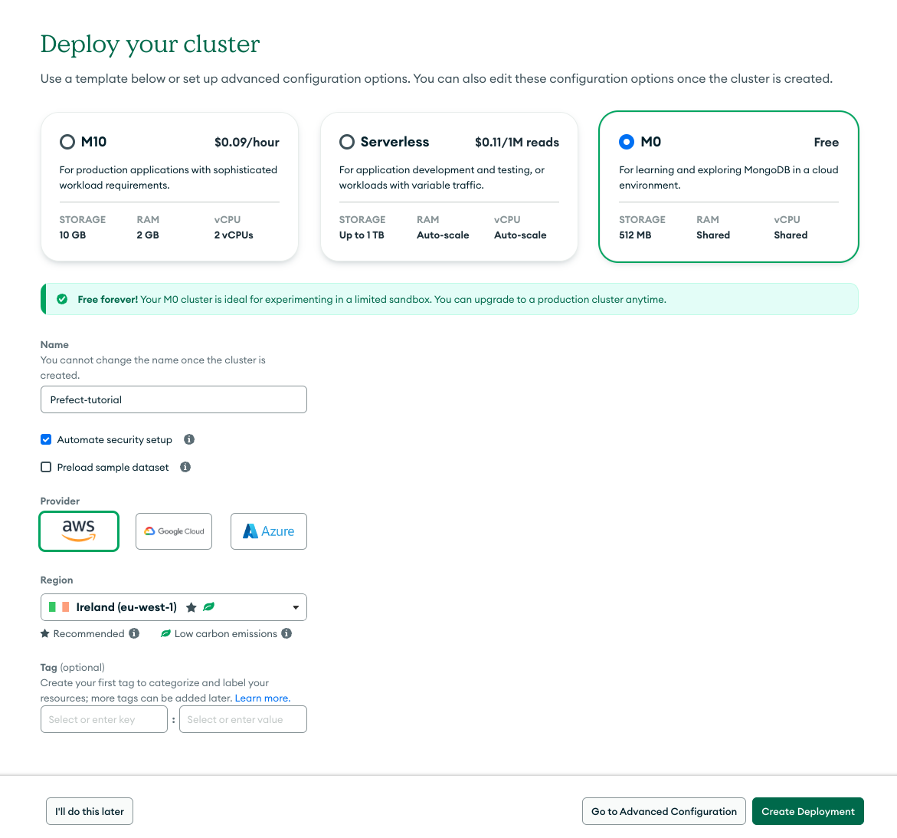

# Prefect Workshop - PyData Amsterdam 2024

To participate fully in this workshop you will need the following:
1. Clone this repo to your local machine!
2. A local Python environment with the required libraries installed, I recommend usinga  new, clean environment to minimise risk of library conflicts; see details below.
3. Docker installed on your local machine; see details below for pulling the appropriate docker images needed in advance of the workshop.
4. Create an account on [MongoDB Atlas](https://www.mongodb.com/cloud/atlas/register) - we will be using the free tier
5. Test that we have set things up correctly.

## 1. Clone this repo
Make a local copy of the codebase.

## 2. Building a new Python environment
Hopefully you are familiar with creating new Python environments using your preferred environment manager, to assist you we have provided three different approaches to build an environment that will work with the the materials in the workshop. We will be using a `Python 3.12` environment, it should work with any recent version but we haven't tested it. We will be using the latest release of `Prefect` which is `v3`.
- For `conda` and `mamba` users you can use the included `environment.yml` file to construct a new environment using. 

        conda env create -f environment.yml
- If you are a `poetry` user the the install requirements are captured in the `pyproject.toml` and `poetry.lock` files.
- If you want to install using `pip` you can use the `requirements.txt` file.

## 3. Pulling the requisite Docker images

We will be using Docker to simulate several differnt data services as part of the workshop and se we need to pull some images and build some local images. If you don't have Docker installed then [refer to the Docker install instructions](https://docs.docker.com/get-started/get-docker/).

- Make sure you have changed directory to the top-level of your clone of this repo where the `docker-compose.yml` file is.
- Run the following command from a terminal in this directory:
        docker compose --build --force-recreate --remove-orphans -d up
    
    You should see an out output in the terminal that looks something like: 

- To confirm the 5 services are running run the command:
        docker ps
  
- Stop everything until the workshop by typing:
        docker compose down
   
    You should see an out output in the terminal that indicates the services have been removed: 

## 4. Setting up a MongoDB Atlas account

MongoDB offers a cloud service for their document database called Atlas. You can create a free account here: [MongoDB Atlas](https://www.mongodb.com/cloud/atlas/register). You should see somthing like, 

You need to create a project to hold the database we will be using. You should see something like, . 

- Create a new project called `Prefect-tutorial`

We then need to create a new cluster and should see a screen like, .

If you click on `Create` you will see, .

- Select the `M0` free tier
- Give it the name `Prefect-tutorial`
- Click `Create Deployment`
- Create a database user and record your password somewhere secure as you will need this later!

Wait a few minutes for the cluster to be deployed. Once it is you should see a screen like, .

- On the left-hand menu select `Network Access`
- Click `Add IP Address` -> `ALLOW ACCESS FROM ANYWHERE`. If you want this to be temporary select the toggle and chose a timeframe so that it will be available on the day of the workshop.
- Click `Confirm`
- On the left-hand menu, under `Deployment`, select `Database`. You should see, .
- Click on `Connect` -> `Drivers`. Make sure `Python` is selected. Copy the connection string that should look something like, `mongodb+srv://<username>:<db_password>@prefect-tutorial.blah.blah.net/?retryWrites=true&w=majority&appName=Prefect-tutorial`
- In the top-level of the local directory create a file called `.env` and add the following line:
    ```MONGO_URI = <The connection string from the previous step making sure the username and password are the correct for your database>```

# 5. Run a test of everything ...

We have a test script to check that we have the correct libraries/modules installed and that MongoDB Atlas has been set-up correctly. Make sure that you have the correct Python environment activated; e.g. if you are a conda user you have run `conda activate pydata24_prefect`. You can then run the test script with:

```python test_script.py```

If eveything is working correctly you should see an output similar to the following:

```
prefect - version 3.0.1 installed
kafka-python-ng - version 2.2.2 installed
spacy - version 3.7.6 installed
spacytextblob - version 4.0.0 installed
pymongo - version 4.8.0 installed
python-dotenv - version (not listed) installed
Pinged your deployment. You successfully connected to MongoDB Atlas!
```
